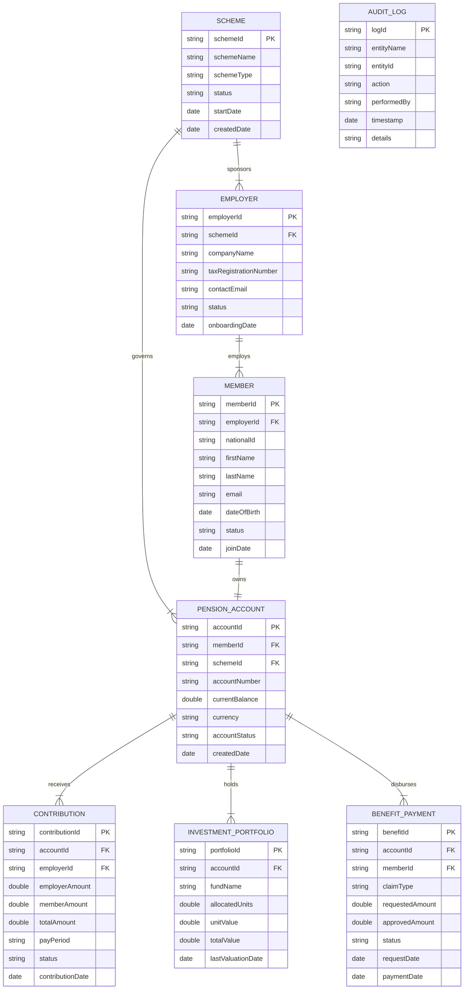
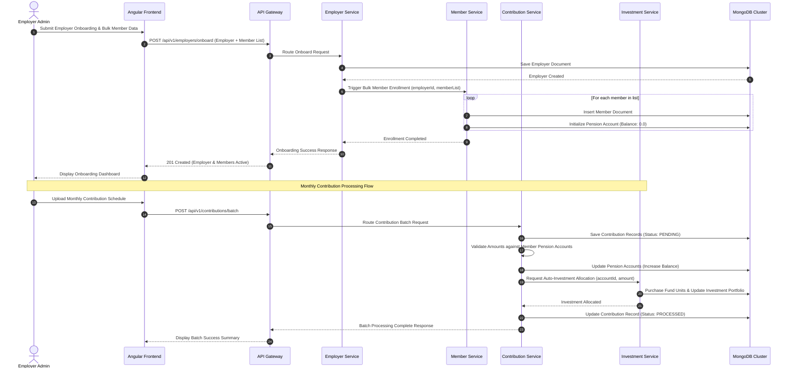
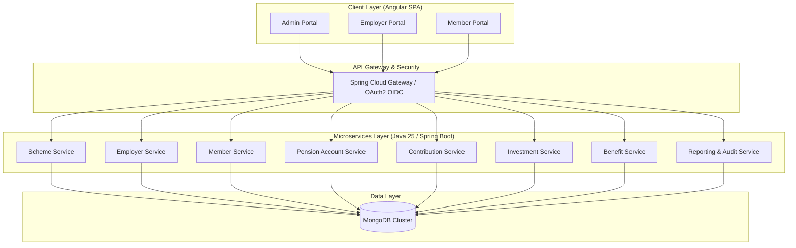

# Design Documentation

## Entity-Relationship Diagram



## Sequence Diagram



## High-Level Design

High-Level Design (HLD) Document - Pension Scheme Setup Platform

1. Architecture Overview
The Pension Scheme Setup Platform uses a cloud-native, microservices-based architecture running on Kubernetes. The platform separates presentation, API gateway, core domain microservices, and persistence layers to ensure high availability (99.5%), horizontal scalability, and multi-tenant security across employers and members.

2. Component Details
- Frontend Layer: Angular single-page application (SPA) providing self-service interfaces for Administrators, Employers, and Members.
- Gateway Layer: Spring Cloud Gateway acting as the API Gateway handling Routing, OAuth2/OIDC JWT Authentication, Rate Limiting, and CORS management.
- Backend Services Layer (Java 25 Spring Boot):
  - Scheme Service: Manages pension scheme configurations, rules, and governance.
  - Employer Service: Handles employer onboarding and verification workflows.
  - Member Service: Manages member registration, demographic data, and account linking.
  - Pension Account Service: Handles account creation, balance updates, and account state transitions.
  - Contribution Service: Manages batch contribution files, validation, and posting.
  - Investment Service: Tracks fund unit valuations, allocations, and portfolios.
  - Benefit Service: Processes claims, eligibility verification, and disbursement requests.
  - Reporting & Audit Service: Generates real-time compliance reporting and central audit logs.
- Persistence Layer: MongoDB Enterprise / Mongo Atlas cluster utilizing document collections optimized for scheme domain aggregates.
- Infrastructure & Platform: Docker containers orchestrated via Kubernetes (EKS/GKE), with automated CI/CD pipelines deploying immutable artifacts.

3. System Architecture Diagram



4. Out-of-Scope Integration Boundaries
Payroll systems, tax processing engines, banking payment clearing rails, and actuarial modeling engines are external downstream systems interacting asynchronously via REST API webhooks or file exchanges.

## Low-Level Design

Low-Level Design (LLD) Document - Pension Scheme Setup Platform

1. Key Microservice Modules & Java Class Responsibilities

1.1 Employer Service (`com.pension.employer`)
- `EmployerController`: REST entry point for onboarding and employer management.
- `EmployerService`: Business logic for employer validation, tax ID verification, and state transition.
- `EmployerRepository`: Spring Data MongoDB repository managing `Employer` documents.
- `Employer`: Domain entity representing corporate sponsors.

1.2 Member & Account Service (`com.pension.member`)
- `MemberController`: Exposes endpoints for bulk enrollment and profile updates.
- `MemberService`: Manages member records, checks duplicate national IDs, and triggers account creation.
- `PensionAccountService`: Generates unique account numbers, handles credit/debit operations on balances.
- `MemberRepository`, `PensionAccountRepository`: Spring Data MongoDB repositories.

1.3 Contribution Service (`com.pension.contribution`)
- `ContributionController`: Exposes API for manual schedule entry and batch CSV/JSON uploads.
- `ContributionProcessor`: Orchestrates batch validation, balance crediting, and investment trigger.
- `ContributionRepository`: Spring Data MongoDB repository for contribution records.

1.4 Investment Service (`com.pension.investment`)
- `InvestmentController`: Exposes fund allocation and valuation queries.
- `InvestmentService`: Calculates portfolio units based on fund NAV and allocates contributions.
- `InvestmentRepository`: Mongo repository for investment portfolio documents.

1.5 Benefit Service (`com.pension.benefit`)
- `BenefitController`: Handles benefit claim submissions and status tracking.
- `BenefitService`: Validates account balances, rules, and prepares disbursement payloads.

2. Critical Java Class Implementations (Sample Schematics)

```java
// Java 25 Domain Document
package com.pension.contribution.model;

import org.springframework.data.annotation.Id;
import org.springframework.data.mongodb.core.mapping.Document;
import java.math.BigDecimal;
import java.time.Instant;

@Document(collection = "contributions")
public record Contribution(
    @Id String contributionId,
    String accountId,
    String employerId,
    BigDecimal employerAmount,
    BigDecimal memberAmount,
    BigDecimal totalAmount,
    String payPeriod,
    ContributionStatus status,
    Instant contributionDate
) {}

public enum ContributionStatus { PENDING, PROCESSED, FAILED }
```

```java
// Spring Boot Service Layer
package com.pension.contribution.service;

import org.springframework.stereotype.Service;
import org.springframework.transaction.annotation.Transactional;

@Service
public class ContributionService {
    private final ContributionRepository contributionRepository;
    private final PensionAccountService accountService;
    private final InvestmentService investmentService;

    public ContributionService(ContributionRepository contributionRepository, 
                               PensionAccountService accountService, 
                               InvestmentService investmentService) {
        this.contributionRepository = contributionRepository;
        this.accountService = accountService;
        this.investmentService = investmentService;
    }

    @Transactional
    public ContributionResponse processContribution(ContributionRequest request) {
        // Validate and save initial record
        Contribution entry = contributionRepository.save(request.toEntity());
        
        // Update account balance
        accountService.creditBalance(entry.accountId(), entry.totalAmount());
        
        // Trigger auto-allocation in investments
        investmentService.allocateFunds(entry.accountId(), entry.totalAmount());
        
        Contribution processed = contributionRepository.save(entry.withStatus(ContributionStatus.PROCESSED));
        return ContributionResponse.fromEntity(processed);
    }
}
```

3. Core REST API Operations Specification

3.1 Employer Management API
- `POST /api/v1/employers`
  - Request: `{ "companyName": "Acme Corp", "taxId": "TAX12345", "schemeId": "SCH-001", "contactEmail": "hr@acme.com" }`
  - Response: `201 Created` -> `{ "employerId": "EMP-9901", "status": "ACTIVE" }`
- `GET /api/v1/employers/{employerId}`
  - Response: `200 OK` -> Returns detailed employer entity.

3.2 Member Enrollment API
- `POST /api/v1/employers/{employerId}/members/batch`
  - Request: List of member entities (National ID, Name, Email, DOB).
  - Response: `207 Multi-Status` / `200 OK` -> `{ "totalProcessed": 150, "failed": 0 }`

3.3 Contribution Management API
- `POST /api/v1/contributions/batch`
  - Request: `{ "employerId": "EMP-9901", "payPeriod": "2026-03", "schedules": [ { "accountId": "ACC-100", "employerAmount": 500.00, "memberAmount": 250.00 } ] }`
  - Response: `202 Accepted` -> `{ "batchId": "BAT-8821", "status": "PROCESSING" }`

3.4 Benefit Claims API
- `POST /api/v1/benefits/claims`
  - Request: `{ "memberId": "MEM-501", "accountId": "ACC-100", "claimType": "RETIREMENT", "requestedAmount": 50000.00 }`
  - Response: `201 Created` -> `{ "claimId": "CLM-301", "status": "UNDER_REVIEW" }`
