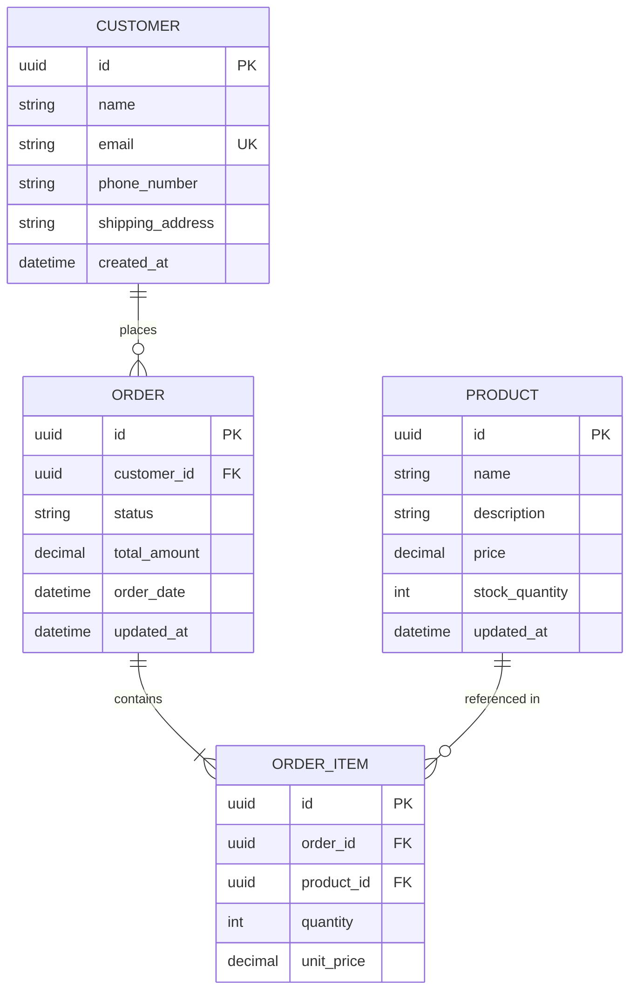
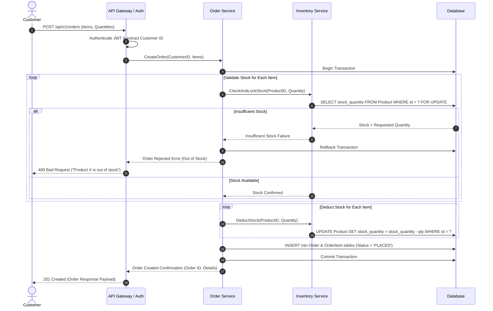
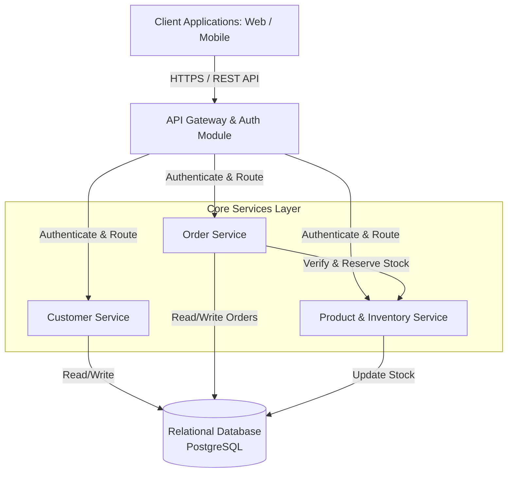

# Design Documentation

## Entity-Relationship Diagram



## Sequence Diagram



## High-Level Design

# High-Level Design (HLD) - Order Management System

## System Overview
The Order Management System (OMS) is structured as a resilient, service-oriented backend architecture designed to handle transactionally safe e-commerce operations. It ensures reliable inventory locking, data consistency, multi-role authentication, and high throughput.

## Core Architectural Components

1. **API Gateway & Identity Provider**:
   - Handles SSL termination, rate limiting, and request routing.
   - Validates JSON Web Tokens (JWT) for authentication.
   - Enforces Role-Based Access Control (RBAC): `ROLE_CUSTOMER` vs `ROLE_ADMIN`.

2. **Order Service**:
   - Manages order lifecycles (creation, status updates, user order queries).
   - Coordinates order creation workflows and status state machine validations.

3. **Inventory / Product Service**:
   - Maintains catalog items and stock levels.
   - Handles stock reservation and restoration under strict ACID isolation levels to prevent race conditions (overselling).

4. **Customer Service**:
   - Manages customer profile data and ensures global uniqueness of email addresses.

5. **Database Layer (Relational DB - PostgreSQL)**:
   - Stores transactional data. Utilizes row-level locking (`FOR UPDATE`) during order processing to maintain strict inventory integrity.

## System Architecture Diagram



## Strategy for Key Technical Requirements

- **Concurrency & Stock Integrity**: Stock deduction is wrapped inside a database transaction using pessimistic locking (`SELECT ... FOR UPDATE`) or atomic SQL execution (`UPDATE products SET stock_quantity = stock_quantity - QTY WHERE id = ID AND stock_quantity >= QTY`) to eliminate race conditions.
- **Order Cancellation**: Cancelling an order (permitted only in `PLACED` status) executes an atomic increment to restore stock (`UPDATE products SET stock_quantity = stock_quantity + QTY`).
- **Pagination**: All listing APIs enforce default and maximum page sizes using standardized limit-offset query parameters.

## Low-Level Design

# Low-Level Design (LLD) - Order Management System

## Key Modules and Responsibilities

### 1. `CustomerModule`
- **CustomerController**: Handles profile retrieval and customer registration.
- **CustomerService**: Enforces unique email constraint check prior to persistence.
- **CustomerRepository**: Interacts with the database for `Customer` entity management.

### 2. `ProductModule`
- **ProductController**: Provides endpoints to browse products with pagination and update products.
- **ProductService**: Manages inventory balances and pricing constraints (`price > 0`).
- **ProductRepository**: Performs database operations on products including row locking for inventory operations.

### 3. `OrderModule`
- **OrderController**: Handles order placement, cancellation, status changes, and order retrieval.
- **OrderService**: Implements the order lifecycle state machine, coordinates transactional stock checks, stock deductions, and stock restorations.
- **OrderRepository**: Manages persistence for `Order` and `OrderItem` records.

---

## State Machine: Order Status Lifecycle

Valid transitions:
- `PLACED` -> `CONFIRMED` (Admin action)
- `PLACED` -> `CANCELLED` (Customer or Admin action; triggers stock restoration)
- `CONFIRMED` -> `SHIPPED` (Admin action)
- `SHIPPED` -> `DELIVERED` (Admin action)

Attempting any illegal state transition (e.g., `SHIPPED` -> `CANCELLED`) throws an `InvalidStateTransitionException`.

---

## API Specifications

All list responses return a standard Paginated Wrapper:
```json
{
  "content": [...],
  "page": 0,
  "size": 20,
  "totalElements": 100,
  "totalPages": 5
}
```

### Endpoints

#### Product APIs
- **`GET /api/v1/products?page=0&size=20&sort=name,asc`**
  - **Access**: Public / Authenticated
  - **Description**: List products with pagination.

- **`POST /api/v1/products`**
  - **Access**: Admin (`ROLE_ADMIN`)
  - **Payload Validation**: `price > 0`, `stock_quantity >= 0`.

#### Order APIs
- **`POST /api/v1/orders`**
  - **Access**: Authenticated Customer (`ROLE_CUSTOMER`)
  - **Description**: Places a new order. Automatically binds customer identity from JWT.
  - **Request Body**:
    ```json
    {
      "items": [
        { "productId": "uuid", "quantity": 2 }
      ]
    }
    ```
  - **Validation Rules**: Each `quantity` must be >= 1. Checks stock availability; if any item is short on stock, aborts transaction and returns `400 Bad Request`.

- **`GET /api/v1/orders/me?page=0&size=10`**
  - **Access**: Authenticated Customer (`ROLE_CUSTOMER`)
  - **Description**: Lists authenticated customer's past orders with pagination.

- **`GET /api/v1/orders?page=0&size=20`**
  - **Access**: Admin (`ROLE_ADMIN`)
  - **Description**: Lists all customer orders across the system with pagination.

- **`GET /api/v1/orders/{id}`**
  - **Access**: Admin or Order Owner
  - **Description**: Fetches single order details and line items.

- **`PATCH /api/v1/orders/{id}/status`**
  - **Access**: Admin (`ROLE_ADMIN`)
  - **Request Body**: `{ "status": "SHIPPED" }`
  - **Description**: Updates order status following state transition rules.

- **`POST /api/v1/orders/{id}/cancel`**
  - **Access**: Authenticated Customer (Owner) or Admin
  - **Description**: Cancels order.
  - **Business Rules**:
    - Rejects request with `400 Bad Request` if current status is not `PLACED`.
    - Updates order status to `CANCELLED`.
    - Automatically restores product stock quantities in a single transaction.
